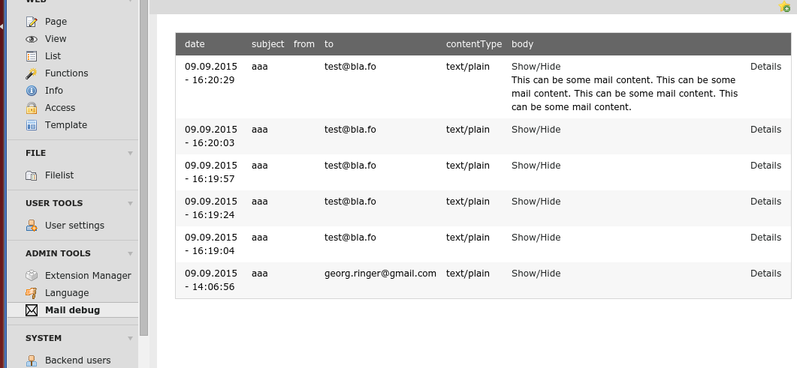

.. ==================================================
.. FOR YOUR INFORMATION
.. --------------------------------------------------
.. -*- coding: utf-8 -*- with BOM.

===============================
TYPO3 CMS Extension "maildebug"
===============================

About
-----

This extensions allows you to debug emails more easily without fiddling around overriding email addresses.
The emails will be saved to the database and won't be sent to the actual receiver.

An additional white listing allows to still send emails to specific receivers.

**Requirements:**

- TYPO3 CMS 6.2 or 7.x

Screenshots
^^^^^^^^^^^


:alt: Screenshot of the backend module

Installation
^^^^^^^^^^^^

Install the extension as always.

The configuration in the Extension Manager allows to define the white listing.
If set to e.g. ```max.mustermann@customer.com,*@company.com``` any emails to *Max Mustermann* and any email address belonging to *company.com* will still get the emails.
Those emails are still also saved in the database.

Contribute!
-----------

Any contribution is highly welcomed.
Please use the issue tracker of the `GitHub Project <https://github.com/cyberhouse/maildebug/issues>`_!